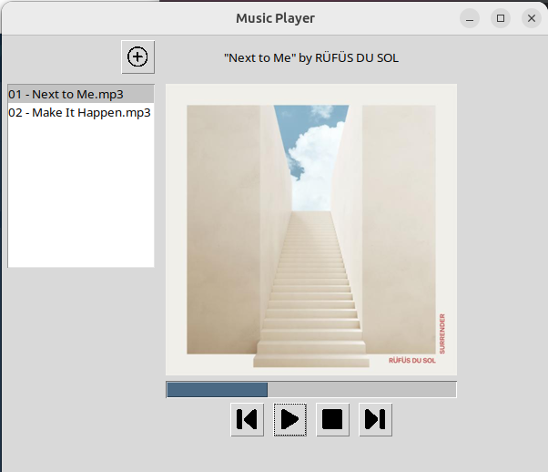

# musicplayer
This project contains a small and simple MP3 music player for Linux built in Python 3.11 
using the Tkinter toolkit. It requires some setup to work properly. Please
follow the instructions below.

## Install
* Copy the files to any preferred directory from this Git repository.
* Setup a Python virtual environment: 
```
python -m venv venv
```
* Activate your new virtual environment then update pip:
```commandline
source venv/bin/activate
pip install --upgrade pip
```
* Install required packages:
```commandline
pip install -r requirements.txt
```

## Setup
In the same file path as the 'musicplayer.py' script, please ensure the following
directories exist:

* ../images
* ../music

The file layout should look like the below:

```
musicplayer/
├── images
│   ├── add.png
│   ├── back.png
│   ├── disc.png
│   ├── musicplayer.png
│   ├── next.png
│   ├── pause.png
│   ├── play.png
│   └── stop.png
├── music
├── musicplayer.py
├── __pycache__
│   ├── main.cpython-311.pyc
│   └── musicplayer.cpython-311.pyc
├── README.md
└── requirements.txt
```

Store any music files you want to play in the '../music' directory. Music files must be
in MP3 format.

## Running the app

To run the app, launch a CLI interface to run the Python script.

```commandline
python /path/to/dir/musicplayer.py
```

## Example

Here is an example image of the app:



## Attributions

* [Ui icons created by nawicon - Flaticon](https://www.flaticon.com/authors/nawicon)
